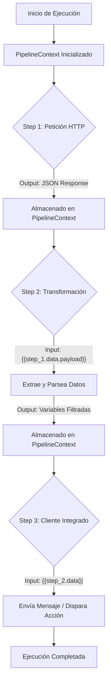

# Worker Tauri

> [!NOTE]
> Este proyecto es un motor de automatización y flujos de trabajo (workflows) de escritorio, construido sobre Tauri (Rust + React). Permite la creación, ejecución y orquestación de flujos de trabajo locales sin depender de infraestructuras en la nube.

La arquitectura de la aplicación está diseñada para funcionar como una alternativa nativa y ligera a plataformas como n8n o Make.com. A través de este motor, es posible encadenar peticiones HTTP, transformación de datos y servicios externos de manera secuencial, transportando el contexto y la información dinámicamente entre cada paso.

## Arquitectura del Motor

El flujo de trabajo se divide en pasos discretos (Steps) que se ejecutan secuencialmente. La información viaja a través de un `PipelineContext` que permite inyectar variables de salida de un paso anterior en las configuraciones del siguiente.

## Estructura del Proyecto

El backend en Rust (`src-tauri/src/`) está dividido en capas modulares que permiten escalar masivamente la cantidad de integraciones disponibles:

- **commands/**: La capa IPC (Inter-Process Communication). Actúa como controlador de interfaces para que el frontend React solicite acciones.
- **engine/**: El núcleo orquestador. Contiene el `WorkflowExecutor` que ejecuta los flujos, el `PipelineContext` para el manejo de estado y variables, y el `CronScheduler` para automatizaciones en segundo plano.
- **steps/**: El sistema de módulos internos. Cada integración (HTTP, Parsing, Mensajería) implementa el trait `Step`, lo que permite agregar nuevos módulos de forma completamente aislada.
- **services/**: Clientes y wrappers reusables para manejar las conexiones externas (como reqwest).
- **models/**: Estructuras de datos puras que representan configuraciones, definiciones de flujos de trabajo y el estatus final de las ejecuciones.
- **errors.rs**: Manejo unificado y estricto de errores, con serialización segura para evitar la fuga de información sensible hacia el cliente.

> [!IMPORTANT]  
> Para agregar un nuevo tipo de Step a la automatización, únicamente es necesario crear un archivo adicional en la carpeta `steps/` e implementar los métodos requeridos por el trait `Step`. El núcleo del orquestador (`engine/`) permanece intacto, garantizando una alta mantenibilidad a largo plazo.

---

Hecho con ❤️ por Brad
