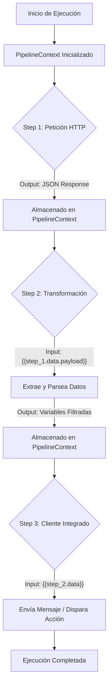

# Flux (Worker Tauri)

> [!NOTE]
> Este proyecto es un motor de automatización y flujos de trabajo (workflows) de escritorio, construido sobre Tauri (Rust + React). Permite la creación, ejecución y orquestación de flujos de trabajo locales sin depender de infraestructuras en la nube.

La arquitectura de la aplicación está diseñada para funcionar como una alternativa nativa y ligera a plataformas como n8n o Make.com. A través de este motor, es posible encadenar peticiones HTTP, transformación de datos y servicios externos de manera secuencial, transportando el contexto y la información dinámicamente entre cada paso.

---

## 🖥️ Arquitectura Frontend (React + TypeScript)

El frontend sigue un modelo estricto de **React Clean Architecture**, diseñado para mantener la UI desacoplada, escalable y predecible a medida que crece el motor. 

Si deseas colaborar o añadir nuevas vistas, debes apegarte estrictamente a las siguientes reglas y estructura de carpetas:

### Estructura de Carpetas Frontend (`src/`)

```text
src/
├── modules/          # Funcionalidades aisladas (Bounded Contexts)
│   ├── flows/        # Ej: Editor de flujos (Canvas, Nodes)
│   ├── home/         # Ej: Pantalla de inicio
│   └── [feature]/    # Nueva funcionalidad
│       ├── core/     # (Opcional) Modelos de dominio y casos de uso puros
│       └── ui/       # Componentes y pantallas específicos de este módulo
│           ├── components/ # Componentes locales (ej: `flow-node.tsx`)
│           └── screens/    # Vistas ruteables (ej: `flow-canvas.tsx`)
│
├── shared/           # Lógica, estados y utilidades compartidas globalmente
│   ├── contexts/     # Stores de Zustand (ej: `tabs-context.tsx`)
│   ├── router/       # Configuración de React Router y registro de Rutas
│   └── utils/        # Helpers agnósticos
│
└── ui/               # Sistema de Diseño y Capa Visual Global
    ├── components/
    │   ├── layout/   # Estructuras maestras (Workspace, TabBar)
    │   └── ui/       # Componentes atómicos (Shadcn UI: Buttons, Inputs, Dialogs)
    ├── hooks/        # Custom hooks globales orientados a UI
    └── styles/       # Tailwind & CSS base
```

### Guía Rápida para Añadir una Nueva Vista o Componente

1. **¿Es un componente visual genérico (ej. un Botón, un Modal genérico)?**
   - Ponlo en `src/ui/components/ui/`.
   - Si usas la CLI de Shadcn (`npx shadcn-ui add`), se instalará aquí automáticamente gracias a la configuración de aliases.

2. **¿Es una pantalla completa o un componente de una funcionalidad de negocio?**
   - Créalo dentro de su módulo correspondiente en `src/modules/[mi-funcionalidad]/ui/screens/mi-pantalla.tsx`.
   - Si no existe el módulo, créalo. No pongas lógica de negocio suelta en la capa `ui/`.

3. **¿Cómo registro mi nueva pantalla en la aplicación?**
   - Ve a `src/shared/router/tab-routes.tsx`.
   - Importa tu pantalla y añádela al arreglo `routes: TabRoute[]`.
   - Especifica su `path`, `title`, el `icon` (de `lucide-react`) y si es `closable`. El sistema de pestañas nativo (`TabBar`) y React Router la detectarán y habilitarán automáticamente.

### Convenciones de Código Frontend

> [!IMPORTANT]
> Todo código en frontend debe cumplir con estas normativas de rendimiento y legibilidad.

- **Kebab-Case Exclusivo**: Todos los archivos y carpetas deben nombrarse en minúsculas y separados por guiones (ej. `mi-nuevo-componente.tsx`, **nunca** `MiNuevoComponente.tsx` ni `miNuevoComponente.ts`).
- **Pestaña Única (Singleton Tabs)**: La navegación de recursos está diseñada para **enfocar lo que ya está abierto**. Usa `openTab('/ruta')` o haz un simple clic; si la pestaña ya existe, el usuario saltará hacia ella previniendo colisiones de autoguardado.
- **Rendimiento React**: Para funciones inyectadas en eventos repetitivos o pasadas como props, utiliza siempre `useCallback`. Para componentes complejos que mutan independientemente, considera el uso de `memo`.
- **Imports Absolutos**: Utiliza siempre los alias configurados:
  - `@/ui/...`
  - `@/shared/...`
  - `@/modules/...`
  - *(Evita los imports relativos `../../../` siempre que sea posible)*.
- **Formateo**: Ejecuta siempre `pnpm run format` antes de subir código. Prettier se encargará de estandarizar las comillas, puntos y comas y el ancho de línea.

---

## ⚙️ Arquitectura del Motor Backend (Rust Tauri)

El flujo de trabajo se divide en pasos discretos (Steps) que se ejecutan secuencialmente. La información viaja a través de un `PipelineContext` que permite inyectar variables de salida de un paso anterior en las configuraciones del siguiente.



### Estructura del Proyecto Backend (`src-tauri/src/`)

El backend en Rust está dividido en capas modulares que permiten escalar masivamente la cantidad de integraciones disponibles:

- **commands/**: La capa IPC (Inter-Process Communication). Actúa como controlador de interfaces para que el frontend React solicite acciones.
- **engine/**: El núcleo orquestador. Contiene el `WorkflowExecutor` que ejecuta los flujos, el `PipelineContext` para el manejo de estado y variables, y el `CronScheduler` para automatizaciones en segundo plano.
- **steps/**: El sistema de módulos internos. Cada integración (HTTP, Parsing, Mensajería) implementa el trait `Step`, lo que permite agregar nuevos módulos de forma completamente aislada.
- **services/**: Clientes y wrappers reusables para manejar las conexiones externas (como reqwest).
- **models/**: Estructuras de datos puras que representan configuraciones, definiciones de flujos de trabajo y el estatus final de las ejecuciones.
- **errors.rs**: Manejo unificado y estricto de errores, con serialización segura para evitar la fuga de información sensible hacia el cliente.

> [!TIP]  
> Para agregar un nuevo tipo de Step a la automatización, únicamente es necesario crear un archivo adicional en la carpeta `steps/` e implementar los métodos requeridos por el trait `Step`. El núcleo del orquestador (`engine/`) permanece intacto, garantizando una alta mantenibilidad a largo plazo.

---

Hecho con ❤️ por Brad
